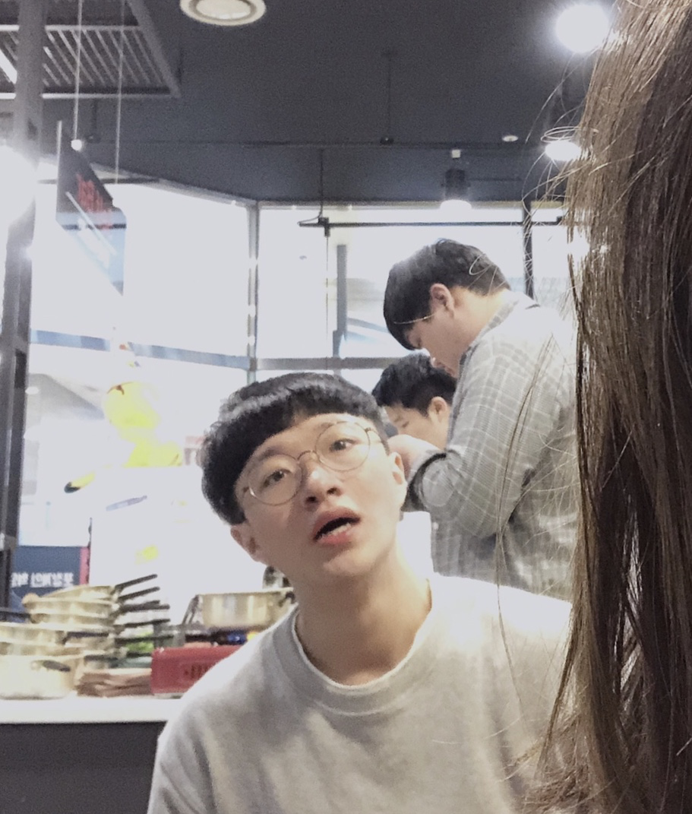

## 프로필

### 인적 사항

- 이름: 박건태
- 생일: 1996.08.30
- 병역: 공군 병장 만기전역(2017.02.13 ~ 2019.02.02.)
- 상태: 대학 재학 중
- 이메일: wlq4568@gmail.com
- Github: https://github.com/EatNug

### 좋아하는 것

- 작은 성취
- 꾸준함
- 헬스
- 대화와 소통

### 싫어하는 것

- 부조리
- 합리적이지 못한 것
- 척 하는 것

### 현재 관심사

- 아키텍쳐 설계
- TDD
- 문서화

## 기술

### 언어

- **Python, Javascript** 는 능숙하게 사용할 수 있습니다.
- **C, Java, Shell Script** 도 레퍼런스를 참고하며 사용할 수 있습니다.

### 클라이언트

- **HTML5, CSS3**.
- **Vanila JS ES6+**.
- **React.js**. redux 패턴에 익숙합니다.

### 서버

- **Express.js**.
- **Django & DRF**.

## 경력

### 개인 프로젝트

#### hufSniper

- 소개: 한국외국어대학교 수강신청 정정기간에 내가 원하는 수업에 빈 자리가 생기면 알려주는 웹 어플리케이션입니다. 최초에는 Express만으로 구현했다가 최근 리팩토링해서, 백엔드는 Express를 이용해 API 서버를 만들었고, 프론트엔드는 React를 활용해 서로 통신하도록 구현했습니다.
- 기술: Express.js & React.js
- 현황: 2019.09.03 ~ 기능 구현 완료 후 CSS 작업 보류 중
- [Github Repository](https://github.com/EatNug/hufSniper)

#### Later

- 소개: 구글링 하면서 찾은 좋은 글들을 나중에 봐야지 생각만 하고 그냥 잊어버리는게 싫어서 이를 간단하게 보관하고 확인하기 위해 만든 크롬 익스텐션 입니다.
- 기술: Vanila JS
- 현황: 2019.11.08 ~ 기능 일부 구현, React 이식 고려 중
- [Github Repository](https://github.com/EatNug/Later)

## 학력

### 학부

- 한국외국어대학교 서울 캠퍼스
- 본전공: 국제학
- 이중전공: 융복합 소프트웨어
- 2015.03 ~ 재학 중

# 활동

### 한국외국어대학교 IT 학회 ADD:ICT

- 소개: 대부분의 학생이 IT 혹은 개발 분야에 무지한 외대에서 해당 분야에 대해 함께 공부하고 지식을 나누기 위한 학회.
- 활동: 학회의 큰 틀을 잡고 1기 활동을 기획하고 운영진으로 활동했습니다.
- [Facebook](https://www.facebook.com/addict2hufs/)

### P.rogramming

- 소개: 서울대학교 벤처경영학과 소속의 비전공자를 위한 웹 프로그래밍 동아리.
- 활동: 10기 회원으로 활동하며 Python과 Django를 배웠고 기수 활동이 종료된 후에는 함께 스터디를 진행하거나 다음 기수를 위해 강연을 하는 등 지속적으로 교류하고 있습니다.
- [Facebook](https://www.facebook.com/p.rogramming3k/)

### 부스트캠프 2019 챌린지

- 소개: 커넥트재단에서 진행한 웹 개발 실무 교육 플랫폼 부스트캠프 2019의 챌린지 프로그램을 수료했습니다.
- 활동: 웹 개발을 위해 Node.js를 기반으로 한 자바스크립트 프로그래밍과 컴퓨터 공학 기초 지식을 공부했습니다.
- [Boostcamp](http://boostcamp.connect.or.kr/)
